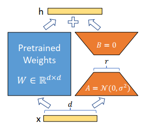

# 预训练
# 指令微调
## LoRA

LoRA将预训练的参数冻结，只训练新增的参数A和B。

其中

$$
A \in \mathbb{R}^{r \times k}, \quad B \in \mathbb{R}^{d \times r}, \quad r \ll \min(d, k)
$$

前向传播过程变为：

$$
h = W_0 x + \frac{\alpha}{r} BAx
$$
### QLoRA
QLoRA在微调之前，先对预训练模型进行量化，再进行微调。

对预训练模型进行量化：首先将模型的参数分组，每组包含64个参数，找出每组参数 $$C_max$$ 的最大值，将参数缩放到 $[-1, 1]$ 之间，然后映射为量化后的参数。

NF4 的量化级别由正态分布分位数计算：

$$
q_i = \frac{1}{2} \left( Q_X \left( \frac{i}{2^k + 1} \right) + Q_X \left( \frac{i+1}{2^k + 1} \right) \right)
$$

其中 $Q_X$ 是正态分布的分位数函数，由此得到量化映射表 $Q^{\text{map}}$。

对于归一化后的权重 $T_i$，计算其对应的量化值：

$$
\hat{q}_i = \underset{j}{\arg\min} \left| Q_j^{\text{map}} - T_i \right|
$$
再对每组最大的参数 $$C_max$$ 进行量化，每256个参数进行量化，量化FP8
# 人类反馈强化学习（RLHF）